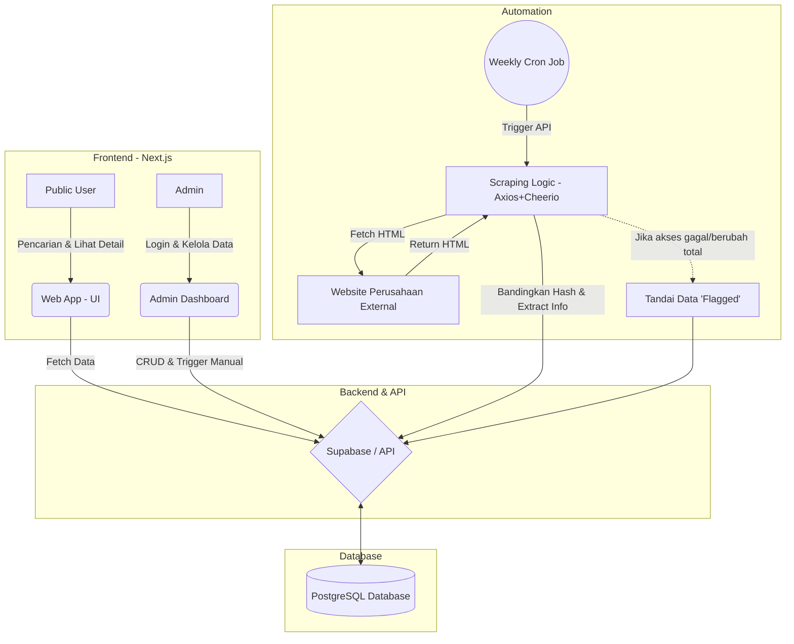
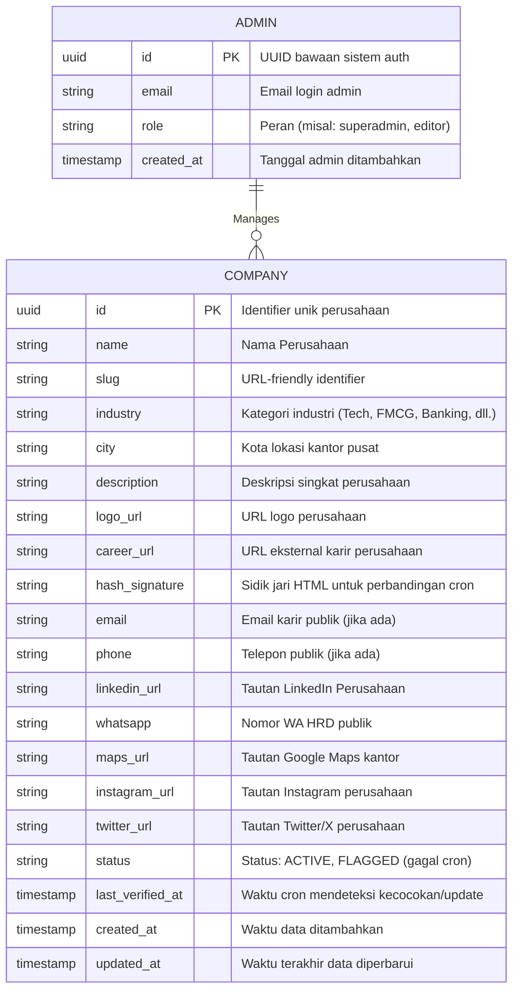

# PRD — Project Requirements Document

## 1. Overview
**Temu Karir (temukarir.com)** adalah sebuah platform direktori yang menghimpun tautan (URL) halaman karir resmi dari berbagai perusahaan di Indonesia. Berbeda dengan portal lowongan kerja konvensional, Temu Karir tidak mengumpulkan (scrape) atau mengunggah ulang lowongan. Platform ini hadir untuk memecahkan masalah pencari kerja—khususnya *fresh graduates* dan profesional junior—yang sering kesulitan menemukan jalur pendaftaran resmi atau meragukan keabsahan informasi kontak rekrutmen perusahaan. 

Tujuan utama aplikasi ini adalah menyediakan sumber informasi yang akurat, aman, dan tervalidasi secara otomatis. Pencari kerja dapat langsung melamar ke sumber resmi, sementara sistem di balik layar akan terus memastikan bahwa tautan dan kontak yang tersedia (Email, Telepon, LinkedIn, WhatsApp, dll.) masih aktif dan valid.

## 2. Requirements
- **Skala MVP:** Mampu menampung dan menampilkan 100-500 perusahaan tanpa kendala performa.
- **Performa:** Waktu muat halaman (load time) harus di bawah 2 detik untuk seluruh daftar perusahaan.
- **Akses Pengguna:** Publik/Pencari kerja tidak perlu membuat akun (Tanpa Login).
- **Akses Admin:** Sistem harus mendukung *Multi Admin* yang diamankan dengan *password*.
- **Integritas Data:** Wajib memiliki sistem otomatisasi mingguan (*cron job*) untuk mengecek perubahan pada website karir perusahaan menggunakan *hashing* untuk menghindari penulisan database (*database writes*) yang tidak perlu.
- **Penanganan Eror (Validation Fail):** Jika validasi otomatis gagal (misal: website perusahaan *down* atau struktur halamannya berubah), sistem tidak langsung menghapus data, melainkan menandainya (*Flagged*) agar ditinjau oleh Admin.
- **Monetisasi:** Tersedia fitur/tombol Donasi (misal: Saweria atau Buy Me a Coffee) untuk operasional platform.
- **Responsif:** Desain harus sepenuhnya *mobile-responsive* mengingat mayoritas target pengguna (fresh graduate) mengakses via perangkat mobile.
- **SEO:** Halaman publik harus dioptimasi untuk mesin pencari dengan meta tags, Open Graph, sitemap, dan structured data (JSON-LD).

## 3. Core Features
**Fitur Publik (Pencari Kerja):**
1. **Direktori & Pencarian:** Menampilkan daftar perusahaan dengan fitur pencarian berdasarkan nama, filter berdasarkan **industri/kategori** (Tech, FMCG, Banking, dll.) dan **lokasi kota**. Pengguna dapat melihat tanggal terakhir kali data divalidasi (*Last Verified Date*).
2. **Halaman Detail Perusahaan:** Menampilkan nama, logo, deskripsi singkat, tautan karir eksternal resmi, dan kontak publik yang tersedia. Prioritas kontak yang ditampilkan: Profil LinkedIn, WhatsApp HR/Perekrutan, Peta Kantor (Google Maps), Media Sosial, Email, dan Nomor Telepon. Dilengkapi dengan "Disclaimer" keamanan.
3. **Dukungan (Donasi):** Tombol bagi pengguna yang ingin memberikan apresiasi finansial untuk pengembangan web.

**Fitur Admin (Pengelola):**
1. **Manajemen Data (CRUD):** Admin dapat menambah, mengubah, atau menghapus daftar perusahaan (bisa dimulai dengan *crawl* awal lalu disesuaikan dengan input manual).
2. **Dashboard Validasi & Anomali:** Melihat daftar perusahaan yang "gagal divalidasi" oleh sistem otomatis untuk penanganan manual. Pemicu validasi manual (*Manual revalidation trigger*) juga tersedia.

**Fitur Otomatisasi (Sistem):**
1. **Weekly Automated Revalidation:** Sistem mengambil HTML halaman karir perusahaan sepekan sekali, mengekstrak kontak via *Regex*, membuat *hash* (sidik jari digital) dari halaman tersebut, dan membandingkannya dengan *hash* di database. Jika berbeda, data otomatis diperbarui; jika gagal, data ditandai (*flagged*). Proses scraping dilakukan secara *batched/staggered* untuk menghindari rate limiting.

## 4. User Flow
**Alur Pencari Kerja (Public):**
1. Pengguna membuka `temukarir.com`.
2. Pengguna mencari nama perusahaan tujuan di kolom pencarian, atau memfilter berdasarkan industri/kota, atau menggulir daftar direktori.
3. Pengguna mengklik kartu perusahaan untuk masuk ke Halaman Detail.
4. Pengguna melihat *Last Verified Date*, kontak resmi (LinkedIn/WA/Email), lalu mengklik tautan URL Karir Resmi.
5. Pengguna ditengarai ke situs resmi perusahaan dan dapat memberikan Donasi via tombol di web Temu Karir jika merasa terbantu.

**Alur Admin:**
1. Admin *login* menggunakan kredensial yang aman.
2. Admin masuk ke Dashboard Utama untuk melihat statistik (total perusahaan, data yang *flagged*/gagal validasi otomatis).
3. Admin memperbaiki tautan URL perusahaan yang *flagged* atau menambahkan perusahaan baru secara manual.
4. Admin dapat menekan tombol "Validasi Sekarang" pada entri baru untuk langsung mendapatkan *hash* awal situs tersebut.

## 5. Architecture
Sistem menggunakan arsitektur *Client-Server* sederhana yang dipisahkan secara rapi (*clean separation*). Pengguna publik mengakses antarmuka yang membaca data langsung dari *Database*, sedangkan sistem *Cron Job* berjalan di belakang layar secara berkala untuk memperbarui data tersebut.

## 6. Database Schema
Aplikasi ini hanya membutuhkan skema dasar untuk manajemen Admin dan Perusahaan. Supabase akan mencakup otentikasi admin secara bawaan.

**Tabel Database:**
1. **`admins`** (Ditangani oleh sistem Auth bawaan, memuat identitas multi-admin).
2. **`companies`** (Tabel utama penyimpanan direktori).

## 7. Tech Stack
Berdasarkan kebutuhan untuk membuat arsitektur *fullstack* yang bersih, stabil, siap *deployment*, dan memiliki kapabilitas *scraping/automation*, berikut adalah rekomendasi teknologinya:

- **Frontend:** Next.js (App Router) dengan TypeScript.
- **Styling & UI:** Tailwind CSS dipadukan dengan *shadcn/ui* untuk komponen yang cepat dan bersih.
- **Backend (API):** Next.js Server Actions / API Routes (untuk menjembatani logika secara *modular* antara *frontend* dan *database*).
- **Scraping Logic:** Axios (HTTP client) & Cheerio (HTML Parser) terintegrasi pada API *Route*.
- **Database / Auth:** PostgreSQL yang di-host melalui Supabase (Supabase menangani otentikasi *Multi-Admin* dan menyediakan API interaksi ke DB yang instan).
- **Deployment & Automation:** Vercel (Hosting aplikasi Next.js sekaligus pemanfaatan fitur **Vercel Cron Jobs** untuk *trigger weekly revalidation*).